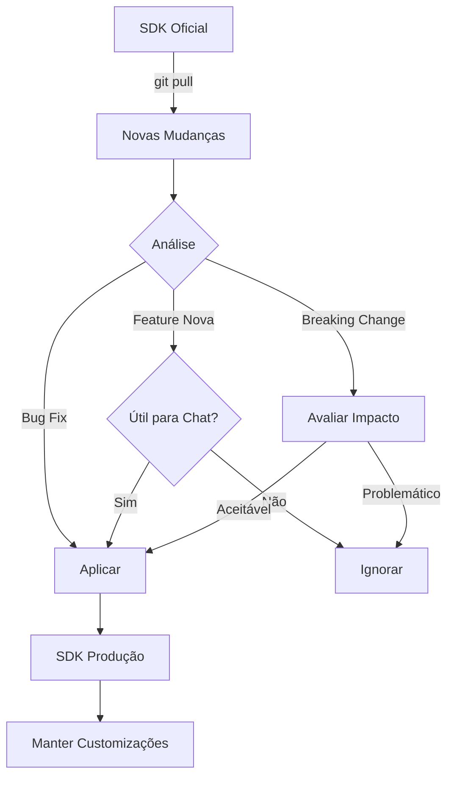

# 🔄 Workflow de Atualização do SDK

## 📊 Hierarquia Estabelecida

```
/Users/2a/.claude/claude-code-sdk-python/  [REPOSITÓRIO OFICIAL - VIVO]
                    ↓
                git pull
                    ↓
              Análise de Diffs
                    ↓
         Proposta de Melhorias
                    ↓
/Users/2a/.claude/cc-sdk-chat/api/sdk/     [SDK PRODUÇÃO - CUSTOMIZADO]
```

## 🎯 Estratégia de Atualização

### 1. **Verificar Atualizações do Repositório Oficial**
```bash
cd /Users/2a/.claude/claude-code-sdk-python
git pull origin main
```

### 2. **Analisar Mudanças**
```bash
# Ver o que mudou
git log --oneline -10
git diff HEAD~1

# Comparar com nosso SDK
diff -r src/claude_code_sdk /Users/2a/.claude/cc-sdk-chat/api/sdk/claude_code_sdk
```

### 3. **Identificar Melhorias Aplicáveis**
- ✅ Bug fixes críticos
- ✅ Melhorias de performance
- ✅ Novos recursos úteis
- ⚠️ Breaking changes (avaliar impacto)

### 4. **Processo de Migração Seletiva**

#### Cherry-pick de Melhorias
```python
# Exemplo: Nova funcionalidade no SDK oficial
# /claude-code-sdk-python/src/claude_code_sdk/new_feature.py

# Avaliar se é útil para nosso caso de uso (chat)
# Se sim, adaptar para /cc-sdk-chat/api/sdk/claude_code_sdk/
```

#### Manter Customizações
```python
# Nossas customizações específicas para chat:
# - Session pooling otimizado
# - Streaming adaptado para SSE
# - Rate limiting multi-usuário
# Estas NÃO devem ser sobrescritas
```

## 🛡️ Benefícios da Abordagem

### SDK Oficial (Referência)
- 📚 **Sempre atualizado** com últimas features
- 🐛 **Bug fixes** da comunidade
- 📖 **Documentação** oficial
- 🧪 **Testado** amplamente

### SDK Produção (Customizado)
- 🎯 **Otimizado** para nosso caso de uso
- 🔒 **Estável** com mudanças controladas
- ⚡ **Performance** ajustada para chat
- 🛠️ **Customizações** preservadas

## 📝 Checklist de Atualização

- [ ] `git pull` no SDK oficial
- [ ] Revisar CHANGELOG.md
- [ ] Identificar breaking changes
- [ ] Testar compatibilidade
- [ ] Cherry-pick melhorias úteis
- [ ] Preservar customizações
- [ ] Testar em desenvolvimento
- [ ] Deploy em produção

## 🤖 Automação com Agente Especialista

O `claude-sdk-specialist` pode auxiliar:

```bash
# Usar agente para analisar diffs
Task tool -> claude-sdk-specialist -> 
"Analise as mudanças no SDK oficial e proponha 
quais devem ser migradas para produção"
```

## ⚠️ Importante

**NUNCA** sobrescrever completamente o SDK de produção com o oficial!
- Perderia todas as customizações
- Quebraria funcionalidades específicas do chat
- Poderia introduzir incompatibilidades

**SEMPRE** fazer migração seletiva e consciente!

## 📊 Fluxo Visual



---

*"O SDK oficial é nossa fonte de inspiração, não de imposição."*