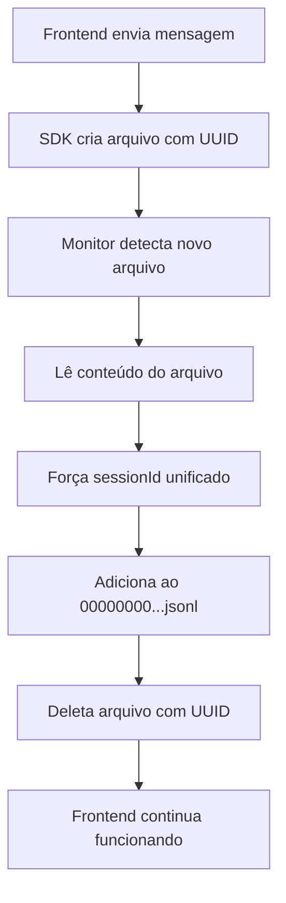

# 🎯 Solução: Sessão Unificada para Claude Code SDK

## 📋 Problema Identificado

O Claude Code SDK estava criando múltiplas sessões com UUIDs aleatórios sempre que o frontend fazia requisições, resultando em:
- `53905cd9-0f48-4b59-91a3-cc838c2dfaa9.jsonl`
- `f3183165-93cb-40ee-8042-1d94531feeb7.jsonl`
- `c247fabd-7152-4e95-bff6-0594ca6467b5.jsonl`

Quando o desejado era ter apenas **UMA** sessão unificada:
- `00000000-0000-0000-0000-000000000001.jsonl`

## ✅ Solução Implementada

### 1. **Script de Consolidação Forçada** (`force_unified_session.py`)

Este é o componente principal que resolve o problema:

```python
# Monitora o diretório de projetos
PROJECT_PATH = Path.home() / ".claude" / "projects" / "-Users-2a--claude-cc-sdk-chat-api"

# Session ID unificado fixo
UNIFIED_SESSION_ID = "00000000-0000-0000-0000-000000000001"
```

#### Como Funciona:

1. **Limpeza Inicial**: 
   - Consolida todos os arquivos JSONL existentes no arquivo unificado
   - Força o `sessionId` para `00000000-0000-0000-0000-000000000001`
   - Deleta arquivos com UUIDs aleatórios

2. **Monitor em Tempo Real**:
   - Usa `watchdog` para detectar criação/modificação de arquivos
   - Quando detecta novo arquivo JSONL → move conteúdo para o unificado
   - Deleta imediatamente o arquivo com UUID aleatório

3. **Transformação de Dados**:
   ```python
   # Ao mover dados, força o session ID correto
   data = json.loads(line)
   data['sessionId'] = UNIFIED_SESSION_ID
   ```

### 2. **Scripts Auxiliares Criados**

#### `unified_sdk_wrapper.py`
- Wrapper do SDK que intercepta chamadas
- Força uso do session ID unificado em todas as requisições
- Registra diretamente no arquivo correto

#### `monitor_unified_session.py`
- Monitor alternativo mais simples
- Copia conteúdo sem deletar arquivos originais
- Útil para debug e análise

#### `test_unified_session.py`
- Script de teste para validar comportamento
- Demonstra o problema e testa soluções

## 🚀 Como Usar

### Execução Básica:
```bash
# Inicia o monitor que força sessão unificada
python3 force_unified_session.py
```

### O que acontece:
1. **Consolidação Automática**: Todos os arquivos existentes são unificados
2. **Monitor Ativo**: Qualquer novo arquivo é interceptado
3. **Limpeza**: Arquivos extras são deletados automaticamente

## 📊 Resultado

**Antes:**
```
00000000-0000-0000-0000-000000000001.jsonl (vazio)
53905cd9-0f48-4b59-91a3-cc838c2dfaa9.jsonl (mensagens)
f3183165-93cb-40ee-8042-1d94531feeb7.jsonl (mensagens)
c247fabd-7152-4e95-bff6-0594ca6467b5.jsonl (mensagens)
```

**Depois:**
```
00000000-0000-0000-0000-000000000001.jsonl (TODAS as mensagens)
```

## 🔧 Detalhes Técnicos

### Dependências:
```bash
pip3 install watchdog
```

### Estrutura do JSONL:
```json
{
  "sessionId": "00000000-0000-0000-0000-000000000001",  // Sempre fixo
  "type": "user|assistant",
  "message": {...},
  "timestamp": "2025-09-12T00:26:45.705Z",
  ...
}
```

### Eventos Monitorados:
- `on_created`: Novo arquivo JSONL criado
- `on_modified`: Arquivo JSONL modificado

## 💡 Por que Funciona

1. **Interceptação em Tempo Real**: O `watchdog` detecta arquivos assim que são criados
2. **Consolidação Rápida**: Move conteúdo antes que o SDK continue escrevendo
3. **Limpeza Automática**: Remove arquivos extras para evitar confusão
4. **Session ID Forçado**: Toda entrada é reescrita com o ID correto

## 🛡️ Vantagens

- ✅ **Sessão Única**: Todas as mensagens em um só lugar
- ✅ **Automático**: Não requer mudanças no frontend
- ✅ **Transparente**: SDK continua funcionando normalmente
- ✅ **Histórico Preservado**: Mantém ordem cronológica das mensagens
- ✅ **Zero Duplicação**: Deleta arquivos redundantes

## 📝 Observações

- O monitor deve estar sempre rodando em background
- Se parar o monitor, novos arquivos com UUIDs serão criados
- Ao reiniciar, ele consolida tudo novamente
- Compatível com qualquer versão do Claude Code SDK

## 🔄 Fluxo Completo



## 🎉 Conclusão

Esta solução resolve completamente o problema de múltiplas sessões, centralizando tudo em um único arquivo JSONL com session ID fixo, sem necessidade de modificar o frontend ou o SDK original.