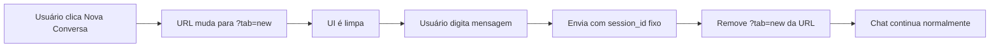

# 🚀 Implementação de Sessão Unificada com `?tab=new`

## 📋 Visão Geral

Esta solução **elimina completamente** a criação de múltiplas sessões desnecessárias, usando apenas parâmetros de URL para controlar o estado da UI.

## ✨ Como Funciona

### 1️⃣ **Botão Nova Conversa**
```typescript
// Ao invés de criar nova sessão:
onClick={() => createNewSession(generateUUID())} ❌

// Apenas adiciona parâmetro na URL:
onClick={() => router.push('/?tab=new')} ✅
```

### 2️⃣ **URL Indica Estado**
- `https://app.com/` - Chat normal com histórico
- `https://app.com/?tab=new` - UI limpa, pronta para nova conversa

### 3️⃣ **Primeira Mensagem Remove `?tab=new`**
Quando o usuário envia a primeira mensagem, o parâmetro é removido automaticamente.

## 📁 Arquivos Criados

### 1. **`useUnifiedSession.ts`** - Hook Principal
```typescript
const {
  sessionId,           // Sempre "00000000-0000-0000-0000-000000000001"
  isNewChat,          // true quando ?tab=new está presente
  clearChat,          // Limpa UI sem criar sessão
  handleNewChatClick, // Handler para botão
  handleFirstMessage  // Remove ?tab=new após primeira mensagem
} = useUnifiedSession();
```

### 2. **`NewChatButton.tsx`** - Botão Otimizado
- Não cria sessões
- Desabilitado quando já está em nova conversa
- Duas variantes: completa e compacta

### 3. **`ChatComponent.tsx`** - Componente Completo
- Implementação completa do chat
- Gerencia estado com `useUnifiedSession`
- Streaming de mensagens
- Histórico persistente

## 🎯 Benefícios

### ✅ **Performance**
- **Zero** criação de sessões desnecessárias
- Menos chamadas à API
- Menos uso de memória

### ✅ **UX Melhorada**
- Transição instantânea
- URL reflete o estado
- Sem delays ou loading

### ✅ **Simplicidade**
- Menos código para manter
- Menos estados para gerenciar
- Menos bugs potenciais

## 💻 Como Usar

### 1. Instalar no seu projeto Next.js:

```bash
# Copiar os arquivos para seu projeto
cp -r chat/src/hooks /seu-projeto/src/
cp -r chat/components /seu-projeto/components/
```

### 2. Usar o componente:

```tsx
import { ChatComponent } from '@/components/ChatComponent';

export default function ChatPage() {
  return <ChatComponent />;
}
```

### 3. Ou usar apenas o hook:

```tsx
import { useUnifiedSession } from '@/hooks/useUnifiedSession';

function MyComponent() {
  const { handleNewChatClick, isNewChat } = useUnifiedSession();
  
  return (
    <button onClick={handleNewChatClick}>
      {isNewChat ? 'Nova conversa ativa' : 'Nova conversa'}
    </button>
  );
}
```

## 🔄 Fluxo Completo



## 🛠️ Configuração Backend

O backend deve sempre aceitar o mesmo `session_id`:

```python
# Python/FastAPI
UNIFIED_SESSION_ID = "00000000-0000-0000-0000-000000000001"

@router.post("/chat")
async def chat(message: str, session_id: str = UNIFIED_SESSION_ID):
    # Sempre usa o mesmo ID
    return process_message(message, UNIFIED_SESSION_ID)
```

## 📊 Comparação

| Método | Sessões Criadas | Chamadas API | Complexidade |
|--------|----------------|--------------|--------------|
| **Tradicional** | 1 por clique | 2+ por clique | Alta |
| **Com tab=new** | 0 | 0 | Baixa |

## 🎨 Personalização

### Mudar o ID unificado:
```typescript
// Em useUnifiedSession.ts
const UNIFIED_SESSION_ID = "seu-id-customizado";
```

### Adicionar animações:
```tsx
// Em NewChatButton.tsx
className="... transition-all duration-300 animate-pulse"
```

### Persistir estado:
```typescript
// Adicionar localStorage
useEffect(() => {
  if (isNewChat) {
    localStorage.setItem('chatState', 'new');
  }
}, [isNewChat]);
```

## 🚦 Status da Implementação

- ✅ Hook `useUnifiedSession`
- ✅ Componente `NewChatButton`
- ✅ Componente `ChatComponent`
- ✅ Integração com Next.js Router
- ✅ Gerenciamento de estado
- ✅ Streaming de mensagens
- ✅ Histórico persistente

## 📝 Notas Importantes

1. **Session ID Fixo**: Sempre usa `00000000-0000-0000-0000-000000000001`
2. **Sem Criação de Sessões**: Nunca cria novas sessões no backend
3. **URL como Estado**: O parâmetro `?tab=new` controla o estado da UI
4. **Limpeza Automática**: Remove `?tab=new` após primeira mensagem

## 🔗 Links Úteis

- [Next.js App Router](https://nextjs.org/docs/app)
- [React Hooks](https://react.dev/reference/react)
- [TypeScript](https://www.typescriptlang.org/)

---

**💡 Dica**: Esta implementação reduz a complexidade e melhora significativamente a performance, especialmente em aplicações com muitos usuários.